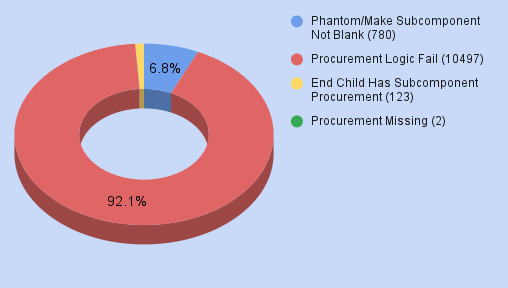

# Atlantis Datathon @ UCI

This is our attempt for the UCI Datathon!
We attempted doing the QuickRelease Challenge using Rust and Excel especially.

The front end was an attempt to make an interactive visualization of how the errors had propogated and we made a querying model using NextJs, TRPC, PostgreSQL and shadcn-ui!

## Visualizations

<iframe src="./QRV Bill of Materials.xlsx" />

We have identified the unique relation amongst the procurement and how the error in one system propogated and how that would be super bad for teh stakes of the company.

## Inspiration
Efficiency! We really wanted to deal with the challenge with a highly efficient language which we are really passionate about Rust! We also had a great deal of experience with excel which to our surprise was multi-threaded by default!

## What it does
We completed the challenge along with making a front-end for our website to show data visualizations and query the data so during debugging it was easier for us to handle the data! We also made a presentation for the data.

## How we built it
The website was built with TRPC, NextJS, Drizzle, PostgreSQL, TailwindCSS.
The job was completed with Excel, Rust.

## Challenges we ran into
Node-parent relationship and cleaning the data set initially given to us was definitely a task that took us a long time. Integrating it all of it and building the website and be able to query all of the data was also a big challenge we faced

## Accomplishments that we're proud of
Making a visualization on the web for the data, by parsing large amounts of data and making it not lag too much.

## What we learned
EXCEL IS MULTITHREADED!!! It was running way faster than python for the task we were trying to accomplish and excel is also Turing complete!

Our Team
Daniel Zavala

Priyansh Shah

Chelsea Wen
